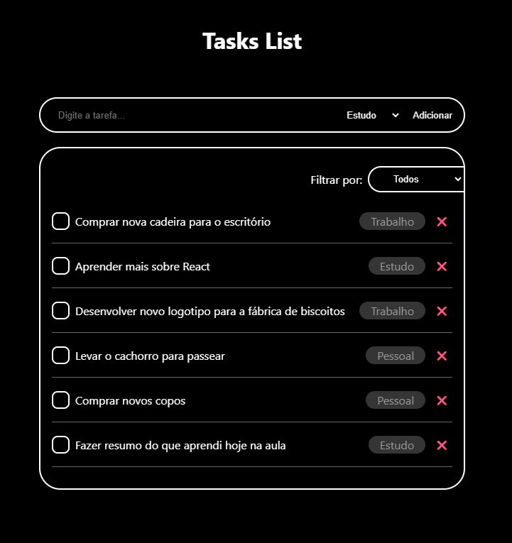

# 📝 Task List App

Uma aplicação simples de lista de tarefas com categorias e filtro, desenvolvida com HTML, CSS e JavaScript.



## 🚀 Funcionalidades
- Adicionar tarefas com categorias (Trabalho, Pessoal, Estudo)
- Marcar tarefas como concluídas
- Remover tarefas
- Filtrar tarefas por categoria
- Persistência dos dados com `localStorage`

  

## 🎯 Tecnologias Utilizadas
- HTML5
- CSS3 (com animações)
- JavaScript puro (vanilla JS)
- `localStorage` para armazenamento local
- Áudios em `.wav` para feedback sonoro

  

## 📁 Organização dos arquivos
```plaintext
📁 task-list
├── 📄 index.html
├── 📄 style.css
├── 📄 main.js
├── 🖼️ favicon.ico
├── 🖼️ screenshot.png
├── 📁 audios
    ├── 🔊 add-task.wav
    ├── 🔊 remove-task.wav
    └── 🔊 warning.wav
  ```


  ## 📦 Como usar

### 1. Clone este repositório:
```bash
git clone https://github.com/AlexanderDuarte/task-list.git
```

### 2. Abra o index.html no seu navegador.

Não é necessário instalar dependências. Tudo funciona com arquivos estáticos!


## ✨ Próximos passos (ideias futuras)

- Implementar modo escuro/tema customizável

- Adicionar prazos ou datas de vencimento às tarefas

- Editar uma tarefa existente

- Aceito sugestões de melhorias 😉
    
